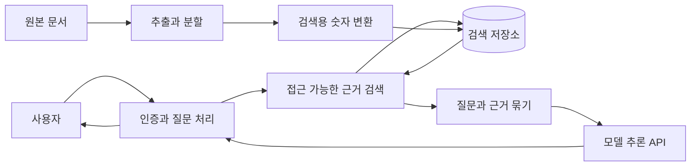
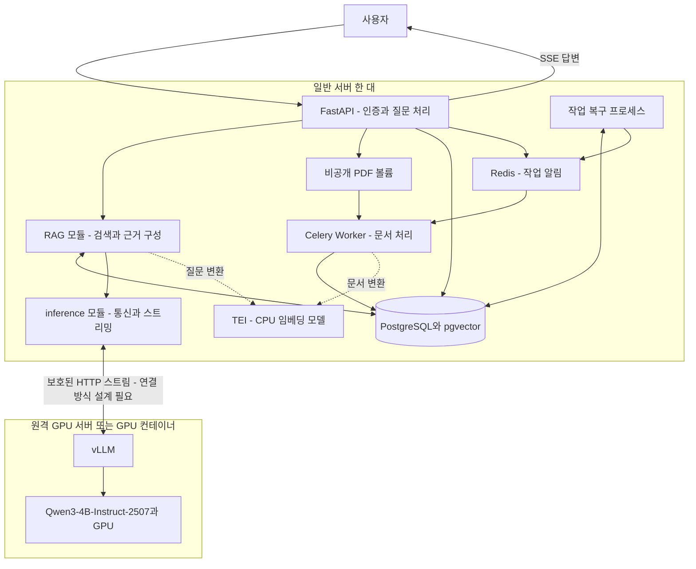

# 실무 참조 구조와 우리 설계 비교

검토일: 2026-09-09. 현재 프로젝트는 설계 단계이며 구현·배포된 시스템이 아니다.

## 결론부터 읽기

**우리 설계는 공식 RAG 참조 구조의 핵심 흐름과 같다. 이를 단일 모델과 작은 서버 구성으로 구현해 검증하려는 프로젝트다.** 다만 같은 그림을 가진다고 안정성·보안·성능까지 검증된 것은 아니다.

여기서 실무 참조 구조는 Microsoft의 RAG·다중 조직 보안 가이드와 vLLM의 서빙 참조 구현을 뜻한다. 특정 구조의 업계 점유율을 조사한 자료는 아니다. 모든 기업이 동일한 도구나 서버 수를 사용하는 것도 아니다.

## 1. 공식 문서에서 확인한 기본 흐름

아래 그림은 공식 문서의 역할을 업체 이름 없이 요약한 것이다. 상자 하나가 반드시 별도 서버나 Microservice라는 의미는 아니다.

질문 경로는 “검색 → 근거와 질문 결합 → 모델 호출”이며, 문서 준비 경로는 “분할 → 임베딩 → 검색 저장소 저장”이다. Microsoft는 이 두 경로와 단계별 평가를 설명한다. 조직별 권한 가이드는 사용자가 접근할 수 있는 정보만 모델의 근거에 포함하도록 요구한다. [RAG 설계 가이드](https://learn.microsoft.com/en-us/azure/architecture/ai-ml/guide/rag/rag-solution-design-and-evaluation-guide), [다중 조직 RAG 보안](https://learn.microsoft.com/en-us/azure/architecture/ai-ml/guide/secure-multitenant-rag)

## 2. 우리 프로젝트에 대응시키기

FastAPI 내부의 RAG·inference 모듈은 같은 애플리케이션이다. Worker와 복구 프로세스는 같은 코드베이스의 별도 실행 역할이다. 이 구성을 제품 Microservice 여러 개로 나눈 것으로 설명하지 않는다.

그림의 일반 서버 한 대·원격 GPU 한 대는 ADR-012에서 합의한 배포 방향이다. 업체·서버 크기·통신 방식은 미선정이다. Prometheus/Grafana는 API·Worker·vLLM·GPU 상태를 관측하는 공통 역할로 계획되어 있으며, 그림에서는 연결선을 줄이기 위해 생략했다. 지표 수집기와 배치 위치는 추가 설계가 필요하다.

임베딩은 글을 검색용 숫자로 바꾸는 모델이다. 답변을 쓰는 생성 모델과 역할이 다르다. ADR-013에서 일반 서버의 CPU TEI 컨테이너와 초기 모델 `multilingual-e5-small`을 합의했다. 질문과 문서에 같은 모델을 사용한다. 실제 실행 호환성·한국어 품질·속도는 검증 전이다.

## 3. 같은 부분과 단순화한 부분

| 비교 항목 | 참조 구조에서의 역할 또는 운영 요구 | 우리 설계 | 판단 |
|---|---|---|---|
| 질문 처리 | 사용자 확인, 근거 조회, 모델 요청 조정 | FastAPI 내부 모듈 | 같은 역할을 한 애플리케이션에서 수행 |
| 모델 호출 | 준비된 모델의 추론 API 호출 | 별도 vLLM | 같은 통신 경계. 직접 운영하는 모델 서버로 구현 |
| 문서 준비 | 문서 처리와 검색 인덱스 생성 | Celery Worker | 별도 작업 경로로 수행 |
| 검색 | 문서 조각과 검색 정보 저장 | PostgreSQL + pgvector | 검색 역할을 기존 DB에 통합한 선택 |
| 조직 권한 | 허용된 근거만 사용 | API Key에서 조직 결정, 권한 조건을 적용한 검색 | 중요한 보안 원칙과 일치. 구현 검증은 남음 |
| 사용자 인증 | 조직의 실제 사용자 신원과 연결 | 사전 생성 사용자와 API Key | 가입·SSO·사용자 수명주기를 단순화 |
| 파일 보관 | 작업자가 접근할 수 있는 원본 보관 | 한 호스트의 영속 볼륨 | 작은 배포에 맞춘 선택. 다른 호스트의 Worker로 확장 시 변경 필요 |
| 장애 복구 | 처리 누락·중복과 실패에 대응 | DB 장부, 처리 권한, 재시도 | 운영 문제를 직접 다룸. 구현량과 테스트 부담이 큼 |
| 운영 지표 | 대기·처리량·지연·자원 사용 확인 | Prometheus/Grafana 계획 | 방향은 같고 수집·대시보드·실측은 남음 |
| 서버 장애 지속성 | 장애가 나도 다른 서버가 처리하도록 구성할 수 있음 | 단일 API 프로세스, 단일 DB 호스트, 단일 GPU | 이중화 없음. 중단 없는 서비스를 보장하지 않음 |
| 여러 모델 서버 관리 | 필요 시 요청 분배와 자동 확장 | 모델 하나, 제한된 동시성 | 4주 범위로 축소. 병목·필요성이 확인되면 확장 |

위 표는 공식 구조와 프로젝트 설계를 대조한 판단이다. 모든 기업에서 SSO·객체 저장소·이중화가 같은 형태로 필수라는 주장은 아니다.

## 4. 큰 서비스로 확장할 때 달라지는 부분

고객과 서버가 늘어나면 요청을 여러 API 서버로 나누고, 작업자를 늘리고, 파일 저장소를 여러 서버가 함께 사용하며, DB 장애에도 복구할 수 있게 만드는 구성이 필요할 수 있다. 모델 서버가 여러 개가 되면 어느 서버로 요청을 보낼지 정하는 계층도 고려한다.

vLLM Production Stack은 Kubernetes 기반으로 단일 vLLM에서 분산 서빙으로 확장하고, 모니터링·요청 라우팅을 다루는 참조 구현이다. 이것이 모든 vLLM 서비스가 처음부터 Kubernetes를 도입해야 한다는 뜻은 아니다. 우리 판단은 단일 GPU MVP에서 추가 운영 도구를 먼저 넣기보다 실제 한계를 측정한 뒤 확장하는 것이다. [vLLM Production Stack](https://docs.vllm.ai/projects/production-stack/en/latest/)

## 5. 지금 보완할 항목

현재 설계를 더 많은 서버로 키우기 전에 다음을 구체화해야 한다. 아래는 검토 결과이며 새로운 도구나 구현 범위를 자동 승인한 목록은 아니다.

1. **임베딩 자원 제한:** CPU TEI 컨테이너 배치를 확정했다. 다음은 문서 작업과 질문 사이의 자원 경합을 제한·검증하는 것이다. 웹 프로세스에서 모델을 직접 로드하지 않겠다는 원래 요구를 지킨다.
2. **원격 통신:** 외부 사용자에게는 애플리케이션만 공개하고, vLLM의 추론·관리·지표 접근은 필요한 내부 주체로 제한한다. 업체가 다르면 같은 사설망이라고 가정하지 않는다.
3. **배포와 복구:** 이미지·모델 버전 고정, 준비 완료 확인, 재시작, 이전 버전 재배포, DB와 원본 파일의 백업·복원 절차를 구체화한다. 서버 여러 대의 자동 전환과는 구분한다.
4. **경보와 측정:** 그래프 표시뿐 아니라 오류 급증·대기 증가·문서 작업 정체를 어떻게 발견할지 정한다. 숫자는 실제 측정으로 확인한다.
5. **과도한 작업 복구 구현 방지:** Celery 위에 직접 만드는 복구 기능은 누락 재전달·중복 결과 방지·중단 복구로 제한한다. 범용 작업 엔진이나 단계별 재개 기능으로 확대하지 않는다.

vLLM은 공개 endpoint 최소화와 reverse proxy 보호를 권고한다. 또한 첫 토큰 지연, 대기 시간, 실행/대기 요청 수 등의 운영 지표를 제공한다. 따라서 통신 보호와 지표 설계는 실제 도구에 연결해 검증할 수 있다. [vLLM 보안](https://docs.vllm.ai/en/stable/usage/security/), [vLLM 지표](https://docs.vllm.ai/en/latest/usage/metrics/)

## 6. 포트폴리오에서 설명할 문장

현재는 “표준 RAG 흐름을 바탕으로, 애플리케이션과 GPU 추론 서버를 분리한 소규모 원격 배포를 설계하고 있다”고 설명할 수 있다.

구현과 검증 후에는 실제 수행한 내용에 한해 “비동기 문서 처리·조직 격리·스트리밍을 구현하고, 원격 GPU 환경에서 장애와 부하를 재현해 개선 결과를 기록했다”고 설명한다. 단일 서버 구성으로 무중단 운영·자동 확장까지 달성했다고 표현하지 않는다.
